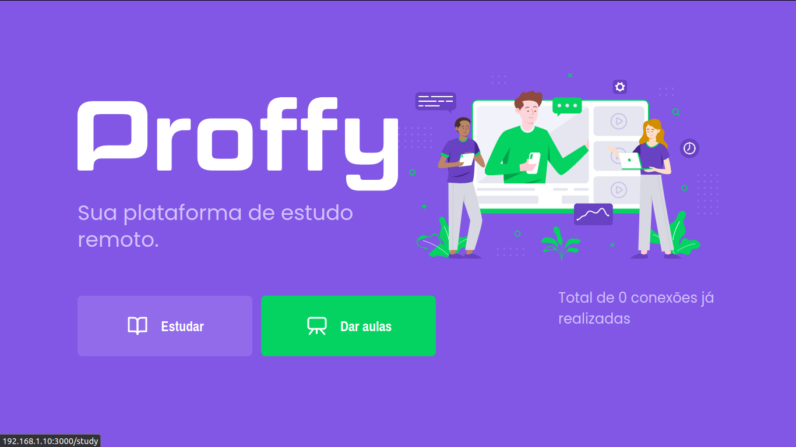
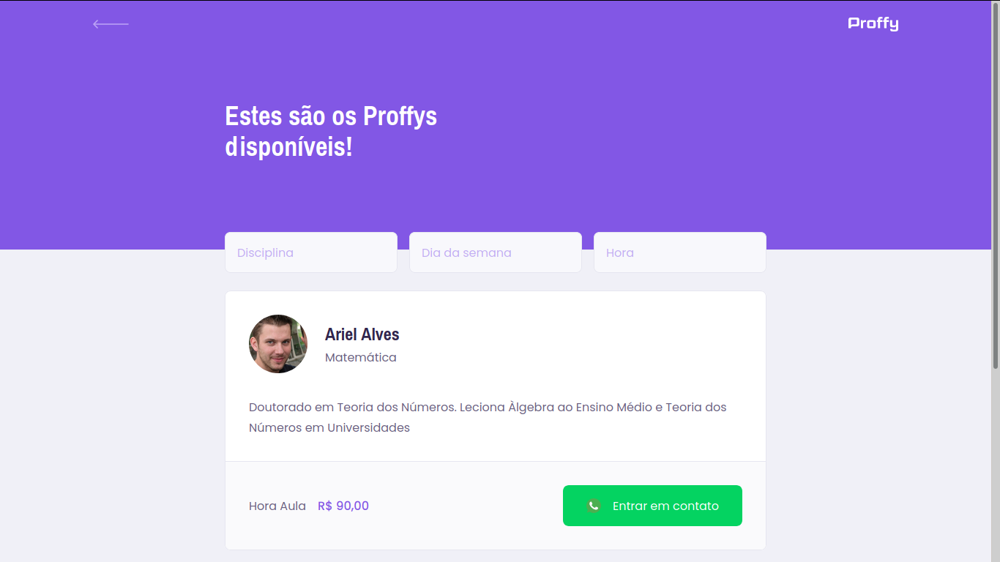
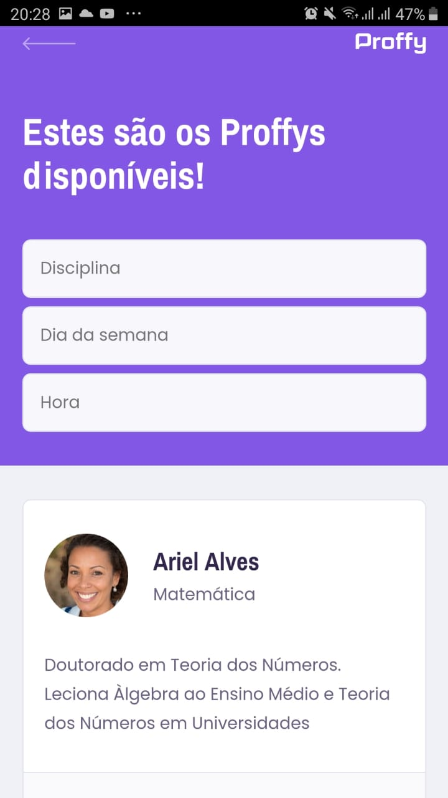

# Proffy - Plataforma de Estudo Remoto
Projeto desenvolvido com a [https://rocketseat.com.br/](Rocketseat) na Next Level Week #2

## Detalhes do Projeto

### Dia 1 - Iniciando pelo front-end responsivo
Desenvolvi a landing page do projeto e a página de listagem dos professores cadastrados na página (Proffys), utilizando a estratégia de mobile first, garantindo uma experiência de design responsivo para o usuário.
Optei por divergir em algumas coisas do design original.

### Dia 2 - Back-end e API REST
Todo o back-end da aplicação foi configurado e houve a criação de uma API REST para a mesma. Utilizei um banco de dados sqlite3 para armazenar os dados.

### Dia 3 - Back-end e front-end web conectados
Conectei o back-end ao front-end web da aplicação. Foi desenvolvida a página de formulário de cadastro de um Proffy e também a lógica de busca de um Proffy seguindo os filtros de horário, dia da semana e disciplina correspondente. 

#### Ideias a serem implementadas
- Adicionar uma nova funcionalidade, na qual poderemos criar grupos de professores, que podem representar uma instituição/curso, e deixar o ambiente mais propício para uma roupagem de EAD. 
